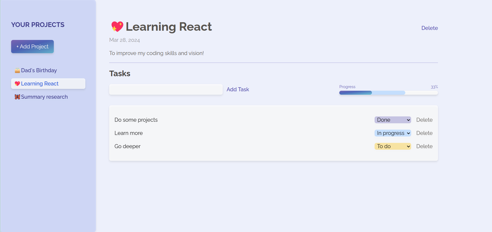
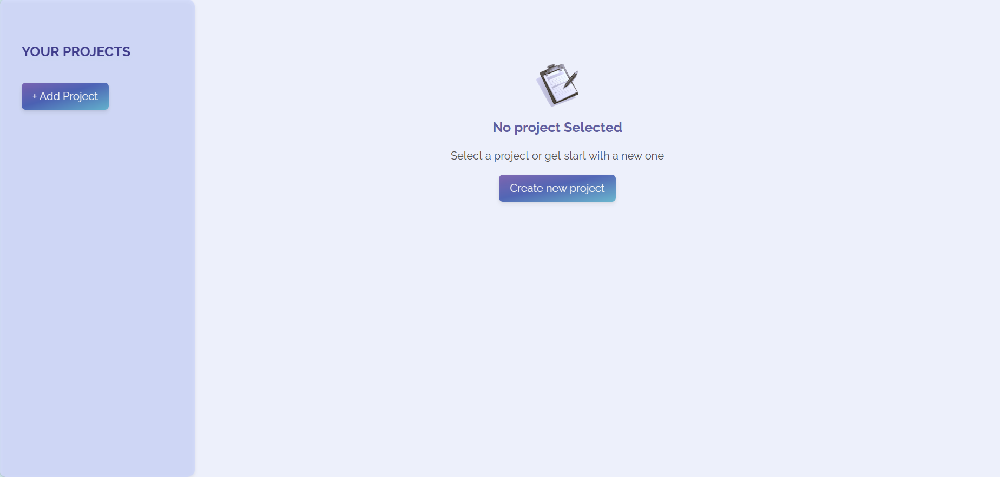
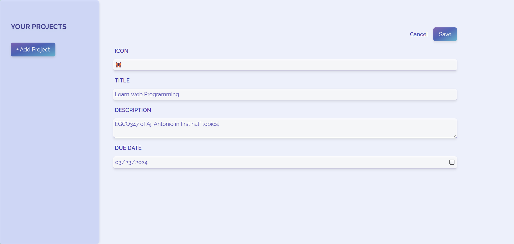
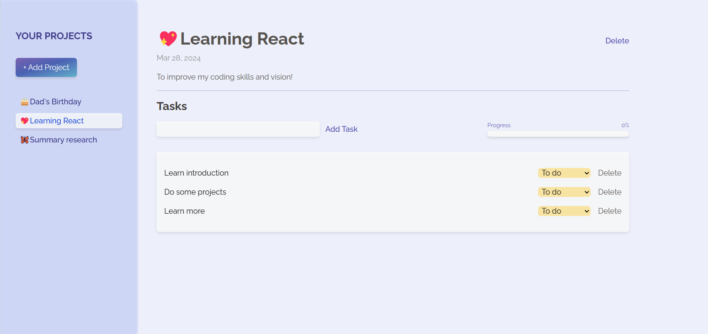

<h1 align="center">Project Taskify</h1>

## About The Project



โปรเจคนี้เป็น front-end application สำหรับจัดการรายการสิ่งที่ต้องทำ (project) และสามารถเพิ่มงานย่อย (task) ของแต่ละรายการพร้อม update สถานะของ task นั้น ๆ ได้ นอกจากนี้ยังสามารถดูความคืบหน้าของแต่ละ project ที่ต้องทำได้จากหน้ารายละเอียดของ project นั้นอีกด้วย

## Application Manual

1. เมื่อ run project ขึ้นมาจะพบกับหน้าแรกที่รวมรายการ projects ทั้งหมดเอาซึ่งจะยังว่างเปล่าอยู่ เราสามารถสร้าง project ที่ต้องการได้จากการกดปุ่ม "Add Project" หรือ "Create new project"



2. กรอกรายละเอียดของ project ที่ต้องการ**ให้ครบทุกช่อง** จากนั้นกดปุ่ม "Save" เพื่อบันทึก หรือกด "Cancle" เพื่อยกเลิก project ดังกล่าว



```diff
- หมายเหตุ: DUE DATE สามารถเลือกได้แค่วันที่เป็นปัจจุบัน หรือในอนาคตเท่านั้น
```

3. หลังจากกดบันทึก project แล้ว application จะนำชื่อ projects ที่สร้างเอาไว้ทั้งหมดมาแสดงเป็น navigate bar ทางด้านซ้ายมือ


4. การดูรายละเอียด project สามารถทำได้เมื่อกดชื่อ project ที่ต้องการจาก navigate bar


5. ภายในหน้า project จะสามารถเพิ่ม tasks ย่อย ๆ ได้ จากการพิมพ์ที่ช่องสีเทาใต้คำว่า "Tasks" จากนั้นกด "Add Task" เพื่อเพิ่ม task ที่ต้องการ ซึ่ง task ที่ถูกเพิ่มมาใหม่จะอยู่ในสถานะ "To do"



โดยสถานะของ task จะประกอบไปด้วย
    - **To do :** สถานะตั้งต้นของ task ที่ยังไม่ได้เริ่มดำเนินการ
    - **In progress** : task ที่เริ่มดำเนินการแล้ว แต่ยังไม่เสร็จสมบูรณ์
    - **Done :** task ที่ดำเนินการเสร็จสมบูรณ์แล้ว

6. task ที่ถูกเปลี่ยนสถานะจะถูกนำไปแสดงเป็นแถบสีบน Progress Bar ซึ่ง*แถบสีดำ หมายถึง task ที่มีสถานะ Done* และ *แถบสีส้ม หมายถึง task ที่มีถานะ In progress* ส่วน Progress Percentage จะถูกคำนวณจาก Done task เท่านั้น


กรณีที่ต้องการลบ task สามารถกด "Delete" ที่ด้านหลังของ task นั้น ๆ ได้

7. เมื่อจากลบ task ที่ไม่ต้องการออกไป application จะคำนวณ Progress ใหม่ จากภาพข้อที่ 6 เป็นภาพดังกล่าว นอกจากนี้ก็สามารถลบ project ได้จากการกด "Delete" ด้านขวาบนตรงส่วนรายละเอียดของ project


8. หลังจากลบ project ผู้ใช้งานจะถูกนำกลับไปยังหน้าเริ่มต้นของ application เพื่อให้เลือกดูรายละเอียด project หรือสร้าง project ใหม่


## Limitations
- ไม่สามารถดูรายละเอียด หรือตรวจสอบ projects และ tasks ที่ถูกกด Delete ได้
- เนื่องจากเป็นเพียง front-end application การ reload page หรือเปิด application ใหม่ จะทำให้ข้อมูลที่เคยดำเนินการไว้หายทั้งหมด

## Point to improve
- ป้องกันการกด Delete โดยไม่ตั้งใจทั้ง projects และ tasks โดยเพิ่มหน้าต่างให้กดยืนยันเพื่อ Delete ก่อนที่จะลบจริง
- สามารถเพิ่ม Due Date ของ task แต่ละรายการได้ และจะ sort tasks จาก Due Date ที่ใกล้ที่สุดไปไกลที่สุด
- เชื่อมต่อกับฐานข้อมูลเพื่อบันทึกข้อมูลไว้ใช้งานโดยไม่ได้สร้าง projects ใหม่ทุกครั้งที่ reload page หรือเปิด application